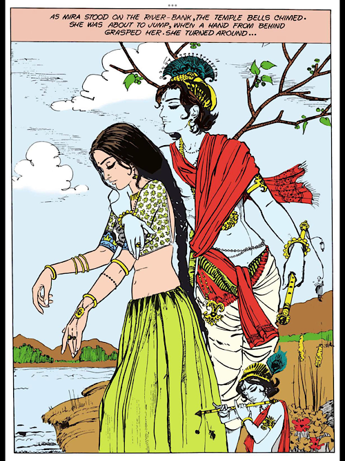
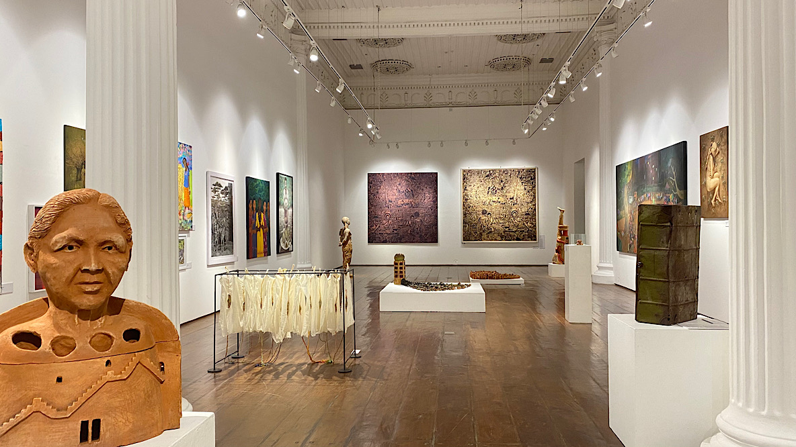
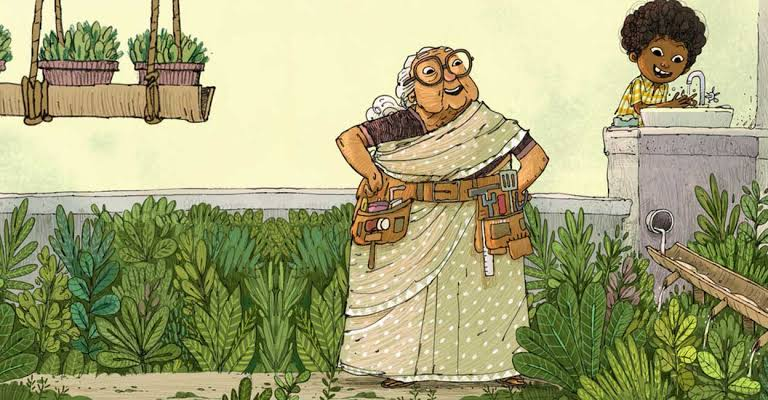
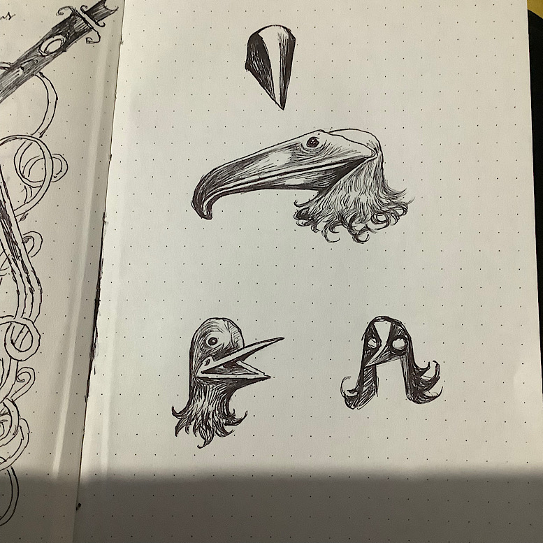

ഈ ആഴ്ച്ചേലെ എന്റെ മെയിൻ താൽപ്പര്യം കോമിക്സ് ആരുന്നു. 

അമർചിത്രകഥയിൽ ഒക്കെ വരച്ചിരുന്ന [യുസഫ് ലിൻ](https://en.m.wikipedia.org/wiki/Yusuf_Lien), കുട്ടിക്കാലത്തെപ്പോലെ ഇപ്പഴത്തെയും  എന്റെ ഹീറോയാണ്.

 
---

കൊച്ചീലെ ദർബാർ ഹാളിൽ പെയിന്റിംഗ് പ്രദർശനം കാണാൻ പോയി. രണ്ടു സുഹൃത്തുക്കളുടെ വർക്കുകൾ ഉണ്ട്. സുദയദാസ്, ആന്റണി. വൻ മോട്ടിവേഷനാണ്.

---

Rajiv Eipe ന്റെ കഥകൾ [ഇവിടെ](https://storyweaver.org.in/users/309-rajiv-eipe) ഫ്രീ ആയി വായിക്കാം. എന്താ രസം. അടിപൊളിയാണ്.

---

ഒരു സ്കെച്ച്ബുക്ക് തീർന്നു.

---

> raghug.com
13-may-2022
