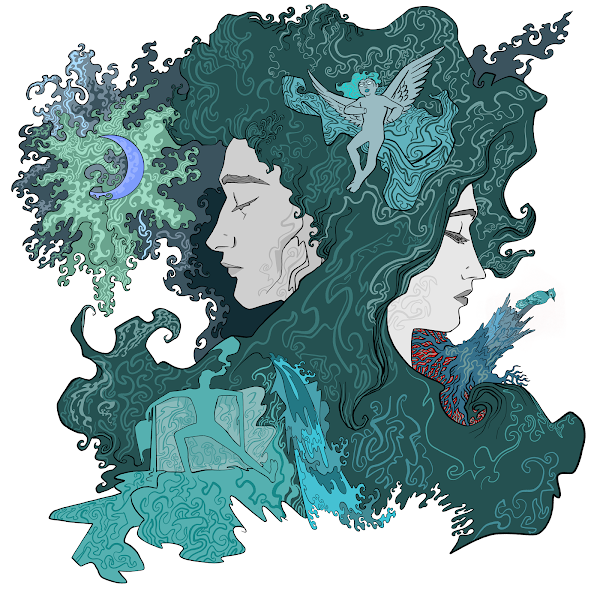

## Melancholy

Digital painting.

Sometimes I feel slippery sands under the feet 

Melting clouds stuck in tree 

Handless angel sitting somewhere on my head 

Kind of bluejay sitting on a trunk 

just forget it's song

Sometimes I feel I'm living in my own dream or 

Somebody's dream

Sometimes I feel It's fine when I spit all these reveries 

as this melted river of my palette

---

Buy as NFT from [opensea](https://opensea.io/assets/ethereum/0x495f947276749ce646f68ac8c248420045cb7b5e/68038019966127804642989589445897043672135742970645717996503286453741438369793)

---

09-11-2021
